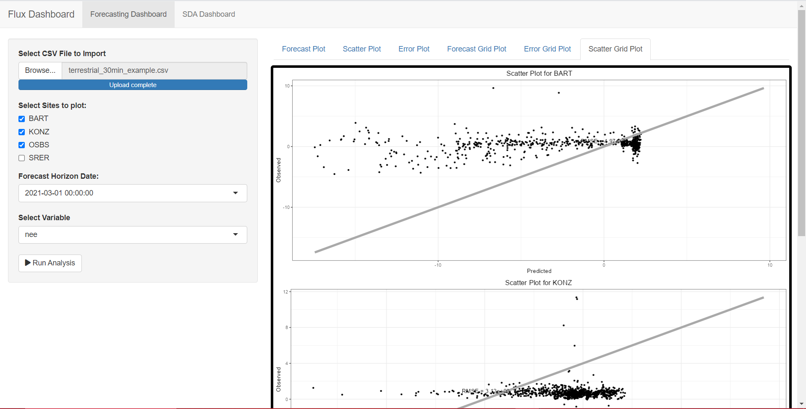

## Project Summary

Organization: [PEcAn Project](https://pecanproject.org/)

Mentors: [Mike Dietze ](https://people.bu.edu/dietze/)(@dietze), [Istem Fer](https://istfer.github.io/)(@istfer), [Henri Kajasilta](https://istfer.github.io/)(@Henri kajasilta)

Student: [Nihar Sanda](https://koolgax99.github.io)(@koolgax99)

## Project Link

GSoC Official Project Link: [Rejuvenating the PEcAn SDA and forecasting Dashboard](https://summerofcode.withgoogle.com/programs/2023/projects/3I7TziS6)

Github Repository: [New Forecasting Dashboard ](https://github.com/koolgax99/new-forecasting-dashboard)

## My Proposal

This project is primarily focused on creating an interactive display of the carbon cycle forecast and data assimilation system of PEcAn. The main goal is to revive the site-specific R Shiny Forecasting and SDA dashboard that is no longer operational and broaden its scope to cover a larger number of sites. Additionally, the plan is to construct a new comprehensive dashboard that combines both SDA and Forecasting graphs. Moreover, the proposal also aims to establish an automated notification email system for the visualizations.

## Pre-GSOC Period

During this period, my aim primarily was to know about the most of the data formats in the Forecasting and the SDA Dashboard.

The Forecasting dashboard currently works on a standard format of EFI data format.

## Work done during GSoC

### Forecasting Dashboard

During my GSoC project, my primary focus was on enhancing the interactivity and user-friendliness of the plots. To achieve this, I implemented a dynamic approach where the plots are not preloaded with data. Instead, users have the flexibility to upload a CSV file directly within the dashboard to access and visualize the plots. This dynamic data loading feature empowers users to explore and interact with the visualizations based on their specific dataset, making the dashboard a versatile and data-driven tool.

<!-- Add table about data specification -->

    <figure>
        
        <figcaption>Landing Page of the Forecasting Dashboard</figcaption>
    </figure>

    <figure>
        
        <figcaption>Data Uploading of the Forecasting Dashboard</figcaption>
    </figure>

The various plots that I have tried to integrate are as follows:

#### Forecasting Plot

This plot is designed to create visually informative and interactive forecast plots for specific environmental variables and sites. It displays a time series plot of observed data, predicted values, and a 95% confidence interval for a given input variable, site, and start date.

    <figure>
        
        <figcaption>Forecasting Plot for site BART</figcaption>
    </figure>

#### Scatter Plot

This plot is designed to create scatter plots that visualize the relationship between predicted and observed values for a specific environmental variable and site. It is particularly useful for assessing the performance of predictive models by comparing predicted values to actual observations.

    <figure>
        
        <figcaption>Scatter Plot for site BART</figcaption>
    </figure>

#### Error Plot

The Error plot function is designed to create error plots that visualize the errors or discrepancies between predicted and observed values for a specific environmental variable and site. It provides insight into the accuracy of predictions by showing how the model's forecasts differ from actual observations over time.

    <figure>
        
        <figcaption>Error Plot for site BART</figcaption>
    </figure>

#### Multi-site Forecasting

The Multi-site Forecasting Plot is a function designed to create a composite visualization of forecasting data for multiple environmental variables and sites. It utilizes the Forecasting Plot function to generate individual forecast plots for selected variables and sites and arranges them in a grid for easy comparison.

    <figure>
        
        <figcaption>Multiple Forecasting Plots for site BART, KONX, OSBS</figcaption>
    </figure>

#### Multi-Site Scatter Plot

The Multi-Site Scatter Plot function allows you to visualize and compare the relationships between predicted and observed values for multiple environmental variables and sites. This tool utilizes the scatter_plot function to create individual scatter plots for selected variables and sites and arranges them in a grid for easy comparison.

    <figure>
        
        <figcaption>Multiple Scatter Plots for site BART, KONX, OSBS</figcaption>
    </figure>

#### Multi-site Error Plot

The Multi-Site Error Plot function enables the visualization and comparison of errors or discrepancies between predicted and observed values for multiple environmental variables and sites. This function employs the error_plot function to generate individual error plots for selected variables and sites, arranging them in a grid for ease of comparison

    <figure>
        
        <figcaption>Multiple Error Plots for site BART, KONX, OSBS</figcaption>
    </figure>

### SDA Dashboard

During my GSoC project, a significant emphasis was placed on rendering the plots in a dynamic manner. In this context, the plots are not preloaded with data upon initialization. Instead, users are required to upload a specific `.Rdata` file directly within the dashboard. This file contains the essential data related to various model runs, allowing users to interact with and generate the plots dynamically

<!-- Add table about data specification -->

    <figure>
        
        <figcaption>Landing Page of the SDA Dashboard</figcaption>
    </figure>

    <figure>
        
        <figcaption>Data Uploading of the SDA Dashboard</figcaption>
    </figure>

The various plots I have tried to inegrate are as follows:

#### SDA Multi-Grid Plots

The SDA Analysis plot function is a powerful tool for conducting comprehensive analysis and visualization of site-based environmental data. It caters to scenarios where data sources provide forecasts, analyzed results, and observed values for multiple environmental variables, measured at various sites and time points. The primary goal of this function is to enable users to evaluate the performance of forecasting models and conduct comparative analyses between the forecasts, analysis results, and actual observations.

Key functionalities of the sda_analysis_plot function include:

- Data Integration: It processes a list of data sources, which typically contain three categories of information: 'FORECAST', 'ANALYSIS', and 'OBS' (observed data). These sources encompass site-specific forecasts, model analyses, and actual observations.

- Statistical Calculations: The function calculates statistics for each data point, including means and confidence intervals, which are vital for assessing the performance of forecasting models. These statistics aid in understanding how well the forecasts and analyses align with observed data.

- Data Organization: The data is meticulously organized for visualization, with consideration for site IDs, variable names, time points, and the type of data (forecast, analysis, or observation). This organized data serves as the foundation for creating insightful plots.

- Visualization: While the function does not directly produce visualizations, it prepares the data to be readily available for visualization or further analysis. Users can employ popular visualization packages like ggplot2 to create customized plots that reveal the relationship between forecasts, analyses, and actual observations.

- The sda_analysis_plot function serves as a crucial step in the process of evaluating forecasting models, conducting comparative analysis, and making data-driven decisions related to environmental variables at multiple sites and time points.

    <figure>
        
        <figcaption>SDA Grid Plot for the site 1000004878</figcaption>
    </figure>

## Technologies Used

### R Shiny

R Shiny is a web application framework that helps convert R-based analyses, models, and visualizations into interactive web apps. It's known for its reactivity, customization options, and integration with R's data visualization libraries.

### R for Data Analysis and Plotting

R is a programming language and environment for statistical analysis, data manipulation, and exceptional data visualization. It integrates seamlessly with Shiny, allowing you to use R for data processing, analysis, and creating dynamic visuals in Shiny web apps. This combination empowers you to build interactive data dashboards for user-friendly data exploration.

## Life @PEcAn

My second term as a Google Summer of Code (GSoC) intern at PEcAn has been an exceptionally rewarding experience. Collaborating with dedicated researchers and scientists who are passionate about ecosystem modeling has been inspiring. The bi-weekly meetings, where I interact with experts from around the world, provide a valuable platform for learning and feedback. What sets PEcAn apart is its welcoming and supportive community, making it more than just a workplace; it's a vibrant ecosystem of knowledge and passion. My journey at PEcAn has deepened my understanding of ecosystem modeling and allowed me to contribute to vital research, and I'm grateful to be part of this remarkable community.

## Acknowledgement

Google Summer of Code (GSoC) stands as an excellent avenue for students to enhance their coding prowess and foster collaborative skills. It offers students the freedom to handpick projects that resonate with their interests, enabling them to refine their proficiency in specific areas. GSoC provides an exceptional platform for skill development and growth.

I am deeply thankful to my mentors for their consistent support and guidance throughout the program. Their mentorship has been invaluable, and I genuinely appreciate the remarkable opportunity they have provided me. I eagerly anticipate future collaborations with my mentors on open source projects.

Moreover, my heartfelt gratitude goes out to GSoC for giving me the opportunity to immerse myself in the vibrant open source community. This experience has been both enriching and rewarding, and I am enthusiastic about the prospect of continuing my journey within this supportive and innovative community. GSoC has not only enriched my skill set but has also opened doors to a world of collaboration and knowledge sharing.
