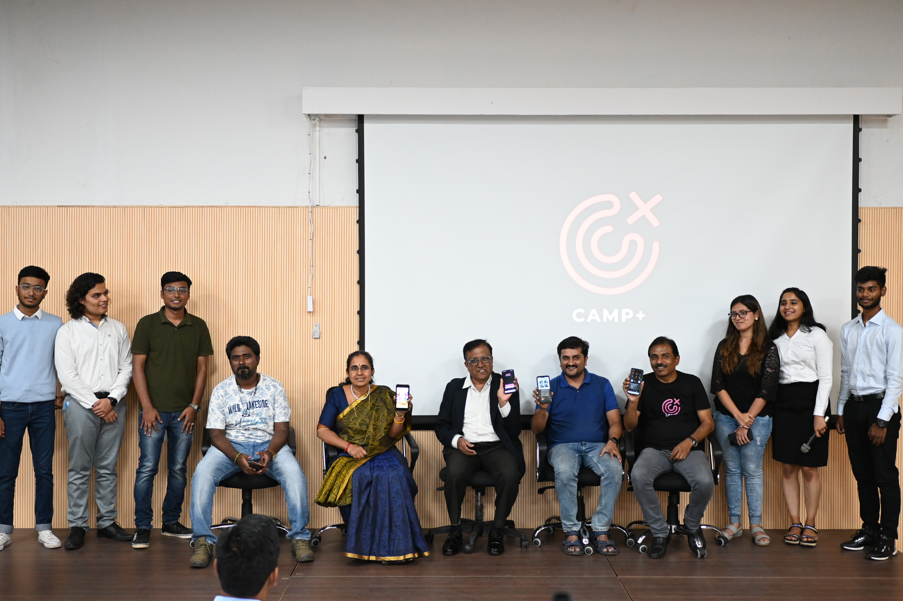
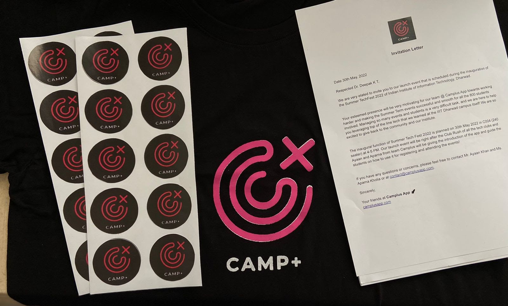
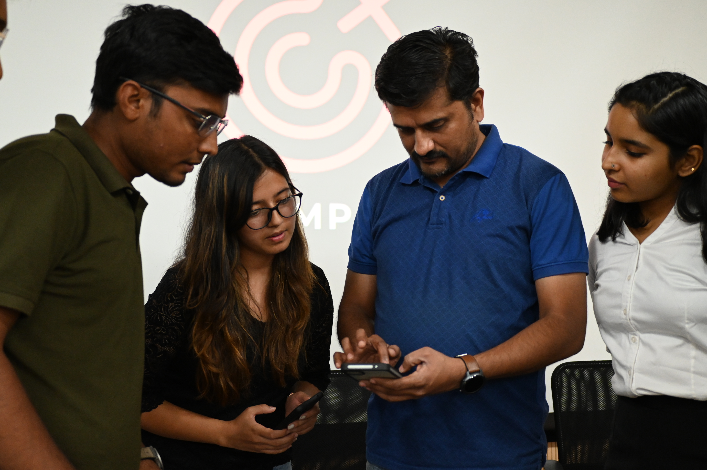
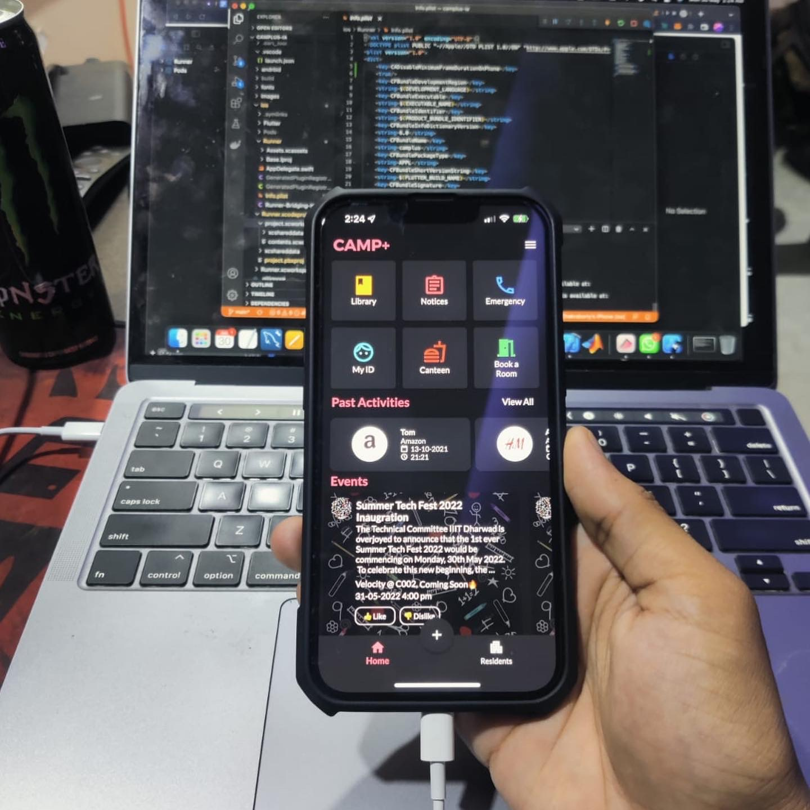
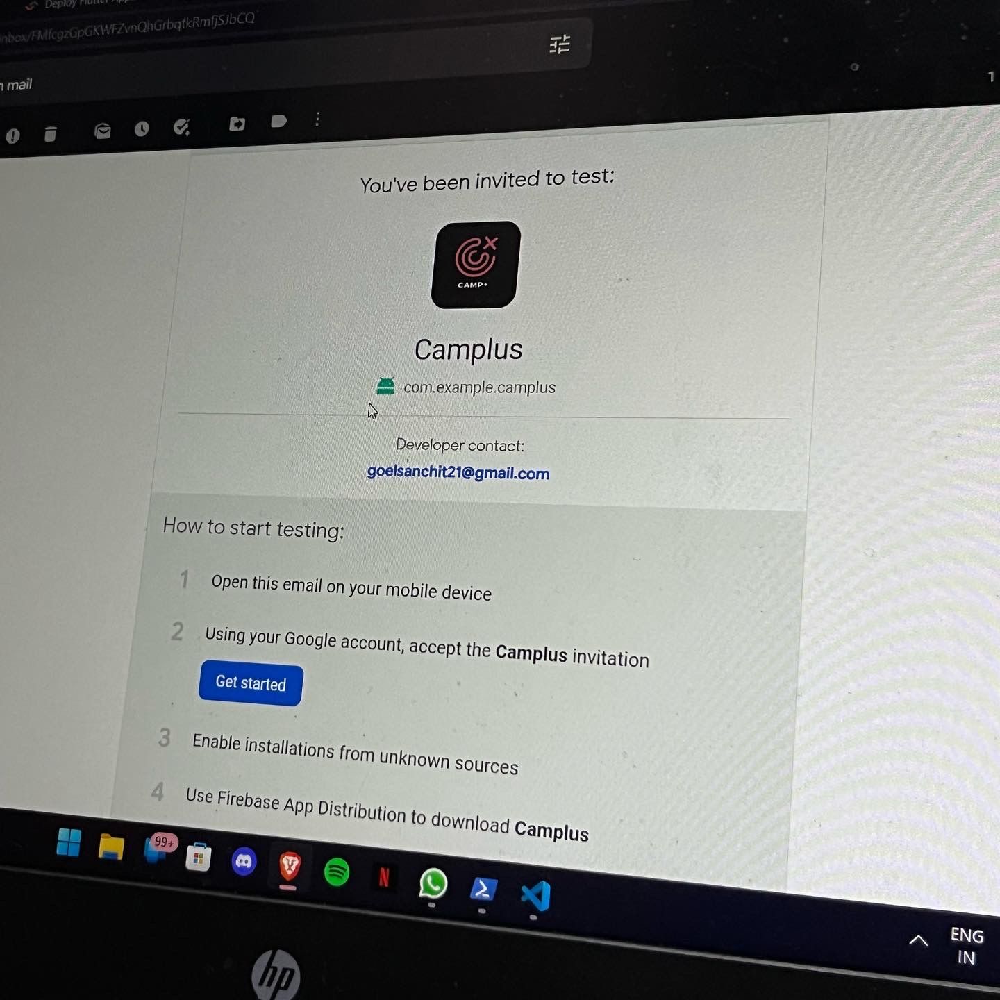

The build up of the Camplus App had started since we got the office space for our startup at IIIT Dharwad’s R&D Lab 3. We had been selected in [International Accelerator's](https://www.internationalaccelerator.com/) final round where top 6 startups make it and pitch in front of the Investment Committee. If selected, the startup has to move to Austin, TX, USA for 12 months to work on the startup full-time. We had a meeting at the residence of the [Director](https://iiitdwd.ac.in/Dr.Kavi_Mahesh.php) of Indian Institute of Information Technology, Dharwad to discuss our options for continuing education at the Institute while staying in the US. In the same meet we pitched the startup deck and got office space, permission for testing on campus, sponsorship for hardware’s (if required) and permission to continue our course in online mode from the US.

Throughout the process, [Dr. Manjunath K V](https://iiitdwd.ac.in/Dr.Manjunath.php) and [Dr. Uma Sheshadri](https://iiitdwd.ac.in/Dr.Uma.php) has been very supportive and helpful!

## Techfest 2022

We had been developing our product, keeping up with our schedule and completing diligence for International Accelerators and 100xVC. With the date of inauguration event of IIIT Dharwad’s Techfest 2022 set at 30th May, our deadlines were fast approaching as this event would provide us an ideal opportunity to officially launch our product to the 800+ students and faculties and formally thank all the faculties and professors who supported us throughout the journey.

    <figure>
        
        <figcaption>Student, organisers and faculties with the Camplus App team 🚀</figcaption>
    </figure>

There were several parameters that we had to take care of in the business side in addition to the technical side. We had to arrange for T-Shirts, Stickers and other startup swags for distribution to the students and faculties at optimum prices. This was a little hectic since we were also handling other arrangements for the clubs as I and many members of our team were the Presidents of various tech clubs of IIIT Dharwad that would present themselves during the inauguration event.

    <figure>
        
        <figcaption>Camplus App swag kit!</figcaption>
    </figure>

A sudden development happened when me, Sanchit (CTO) and Gourab (COO) got to learn that we got into the Summer Research Internship at Indian Institute of Technology, Bombay that we had applied to earlier. This meant we had to travel to Mumbai for the internship, and we would have to remotely manage the whole inauguration event and the Camplus App’s launch event remotely.

    <figure>
        
        <figcaption>Our team helping faculties install the Camplus App on their devices</figcaption>
    </figure>

We had already made a huge commitment on the tech side of things since we planned to host the summer Techfest 2022 using the Camplus App’s event management feature, which still wasn’t properly ready for the users. It was a race against time, which went on till the very last moment. We finally prepared a build the day before the launch event.

## Enter Bugs!

    <figure>
        
        <figcaption>Picture of the Camplus App: We need to update the events!</figcaption>
    </figure>

Due to a last minute change, and a problem in the backend, we had to start debugging on the morning of the day of the launch. Ayaan and Aparna from our team were about to present the app to the students and faculty at 5 pm IST, but our app wasn’t ready yet. The whole team was freaking out and the texts in the Camplus App group chat was going wild. Sanchit managed to build and ship right around 5:05 pm. It calmed the team down a little. Prof. Akki, the Registrar, was giving his speech. We decided to take another high risk move. We decided to do some quick improvement while the Registrar was giving his speech. At this point, the speech and our app development was happening real-time. We finally built and shipped the app, and Aparna & the faculties received the link right when they were about to go to the stage.

    <figure>
        
        <figcaption>Dr. Manjunath K V giving a speech for Camplus App to the students 👀</figcaption>
    </figure>

Our last moment improvements turned out to be critical, since one of the faculties were specifically looking for thoses set of features. All in all, the app launch went successfully, We got official recognition and acceptance from the Institute and students. The tech events are being hosted through our app currently. And for the 2 month testing phase, we have decided to launch a bug-bounty program for the students and faculty members who find out a bug. All they have to do is take a screenshot of the bug, and upload it from our Report a Bug section along with the title and the description. The top bug hunters will be rewarded during the end of the fest.

    <figure>
        
        <figcaption>Yayyy! Finally Shipped! 🥳</figcaption>
    </figure>

## Conclusion

The whole experience was very intense and fun with several ups and downs. I’m happy that the event ended successfully. But what I got to learn is that we have this repeating pattern that we don’t tend to work much right up until the last moment. But giving high commitments, we end up achieving more than normally possible, but this method has high stakes, and has high chances of failure. I need to work on changing this pattern, but managing the risk properly.
