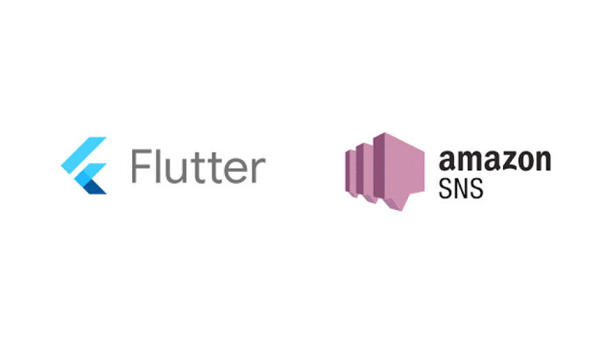

Welcome everyone, in this article we will be implementing the Flutter push notifications using the AWS Simple Notification Services (SNS). We will be using Firebase Cloud Messaging as the Service Provider for the Messaging.

## Creating a Flutter Project:

Firstly we will create a new project and I will name it flutter_aws_notification.

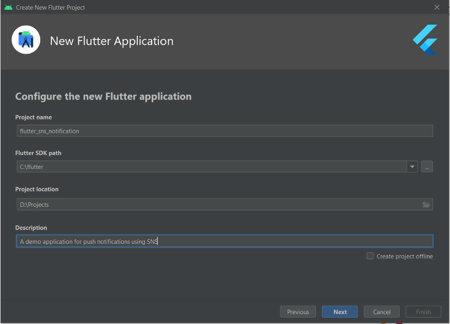

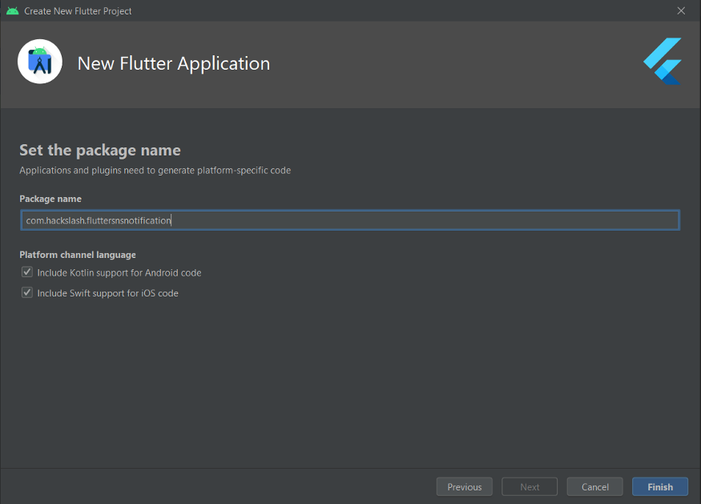

You can give any name to your package. Ensure that you remember it because we will need it while registering our app on Google Firebase.

## Creating a Firebase Project:

Now, once the Flutter app is created, let's go to the Google Firebase. You should have a Google Firebase account for application registration. Let's create a new project in your firebase account.

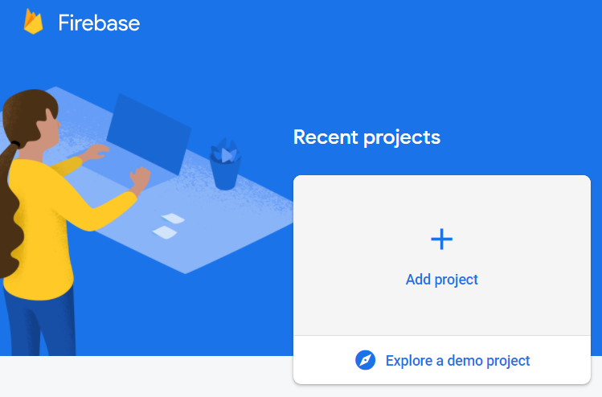

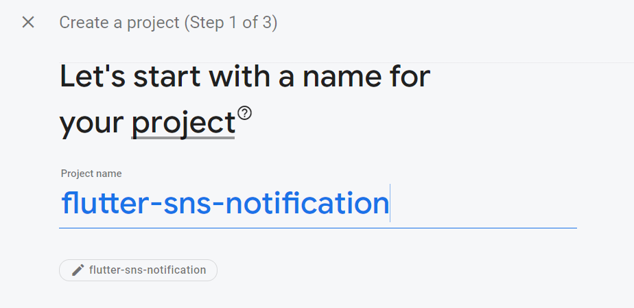

For steps 2 and 3 in the Firebase click on Next and let it be on default. After the application is registered we will be redirected to the home page of the project.

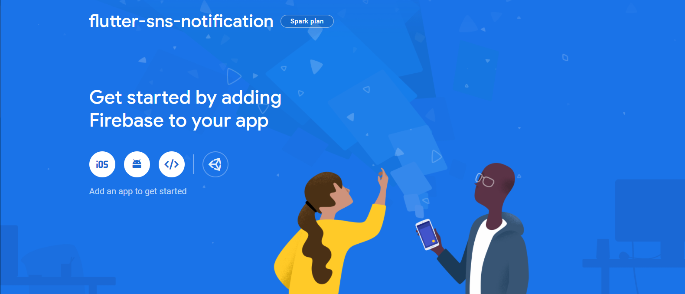

Now click on the Android logo on the home page of the project. We will be registering the android app firstly.

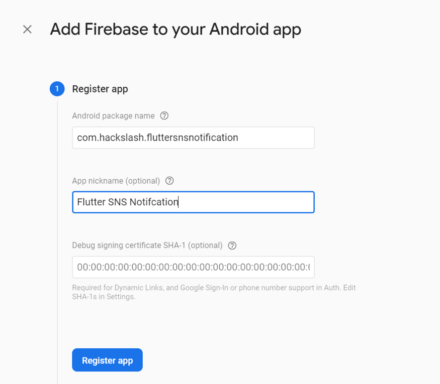

In the Android Package name enter the same name you entered while creating the flutter application. After that click on the Register button, which will register our flutter application on the firebase.

## Connecting the Firebase Project And Flutter Application

After registering we will be given a google-services.json file to download. Download the file and it should be saved our Flutter application, in the following path: `android / app / google-services.json`

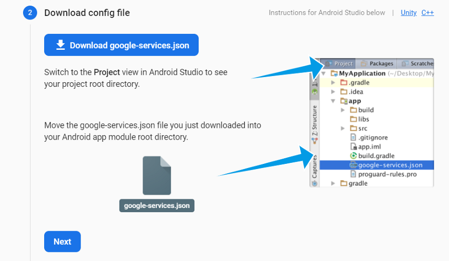

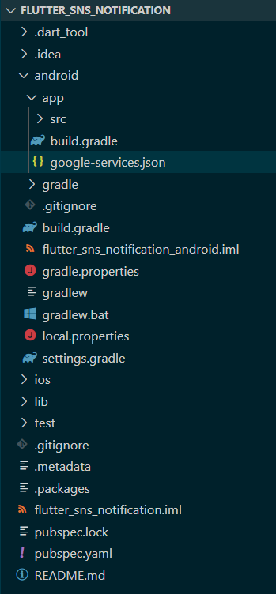

Now we have to configure our flutter application to connect to our google firebase. In the android/app/src/build.gradle file, add the below line of code just after apply from: `$flutterRoot/packages/flutter_tools/gradle/flutter.gradle`

> apply plugin: 'com.google.gms.google-services'

> Inside "defaultConfig", configure the applicationId according to the Android Package Name inserted in the firebase

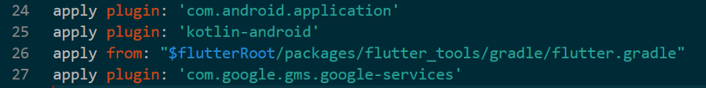

In the android / build.gradle add the below line in dependencies{……}

> classpath 'com.google.gms:google-services:4.3.3'

And finally, we need to edit the permissions of our application in the file AndroidManifest.xml

```python
<intent-filter>
  <action android:name="FLUTTER_NOTIFICATION_CLICK" />
  <category android:name="android.intent.category.DEFAULT" />
</intent-filter>
```

Next, we will have to install few of the firebase packages in our flutter application. Add the firebase_messaging and firebase_core packages in your pubspec.yaml.

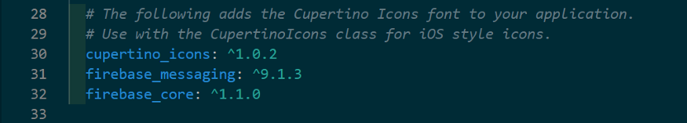

Our Flutter Application is successfully connected to the Firebase Project. Our next step is to complete the Flutter Application and adding some simple UI.

## Finishing Flutter Application

Create a pages folder in the lib folder of the flutter application. in that folder create a file and name it home_page.dart. And add the below code to the page.

```typescript
import 'package:firebase_messaging/firebase_messaging.dart';
import 'package:flutter/material.dart';

class HomePage extends StatefulWidget {
  @override
  _HomePageState createState() => _HomePageState();
}

class _HomePageState extends State<HomePage> {
  final FirebaseMessaging _firebaseMessaging = FirebaseMessaging.instance;

  @override
  void initState() {
    super.initState();
    _firebaseMessaging.getToken().then((token) => print(token));
  }

  @override
  Widget build(BuildContext context) {
    return Scaffold(
      appBar: AppBar(
        title: Text('Flutter SNS Messaging'),
      ),
      body: Container(
          child: Center(
        child: Text("You have been subscribed"),
      )),
    );
  }
}

```

Let's connect the home_page.dart and main.dart. Replace the below code in the main.dart

```typescript

import 'package:firebase_core/firebase_core.dart';
import 'package:flutter/material.dart';
import 'package:flutter_sns_notification/pages/home_page.dart';

void main() async {
  WidgetsFlutterBinding.ensureInitialized();
  await Firebase.initializeApp();
  runApp(MyApp());
}

class MyApp extends StatelessWidget {
  @override
  Widget build(BuildContext context) {
    return MaterialApp(
      title: 'Material App',
      home: HomePage(),
    );
  }
}

```

### All about the code

- In the home_page.dart, we created a widget, because, we will tell the user that he has subscribed to the push notification.
- We have created an instance called \_firebaseMessaging using FirebaseMessaging()
- Using \_firebaseMessaging.getToken() we're registering our app with firebase and we will receive a token which we will print out in the console.

After adding the above codes to their respective pages, our application is ready to run. Now let's run our application and you should get the UI as shown below.

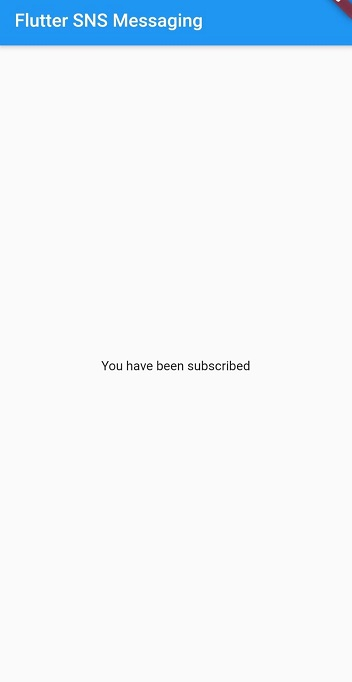

Now check your Visual Studio Terminal or the terminal of your IDE and copy the device ID.

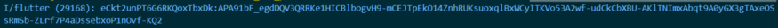

Copy this device ID and save it securely. Before starting the SNS part we will be needing the Server Key from Google Cloud Messaging. So let's go back to the Firebase console and go to the `flutter-sns-notification` project. In the navigation menu on the left side click on the `Project Overview` and go to the `Project Settings`. In the Project Settings, you can see the Cloud Messaging tab in that tab you could find your own FCM Server ID. Copy the server ID and keep it securely somewhere because we will need that to create a Platform for our application in AWS.

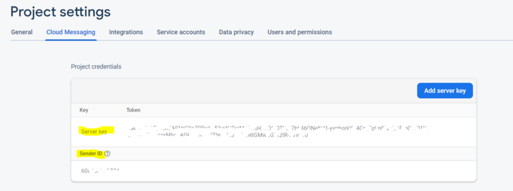

After this lets go to the AWS dashboard and lets start the actual SNS notification creation. Firstly, login to your AWS console and go to the SNS Dashboard. And inside the dashboard click on the Mobile Push Notification option.

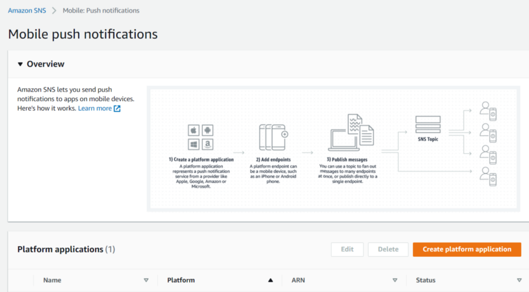

Inside the mobile push notification dashboard, we will now create a platform for the application. You can check more details about the AWS SNS in detail here. Next Click on the "Create Platform Application" button and continue by adding the details. Enter the Application Name as aws-sns-notification and in the Push notification platform select the Firebase Cloud Messaging because we have used Firebase Cloud Messaging as our service provider. Next, in the API Key enter the Server Key from the Firebase Console.

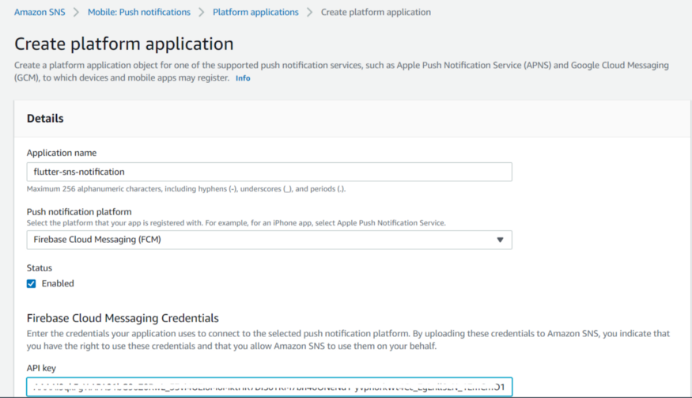

After this click on the create button below and your platform will be created.

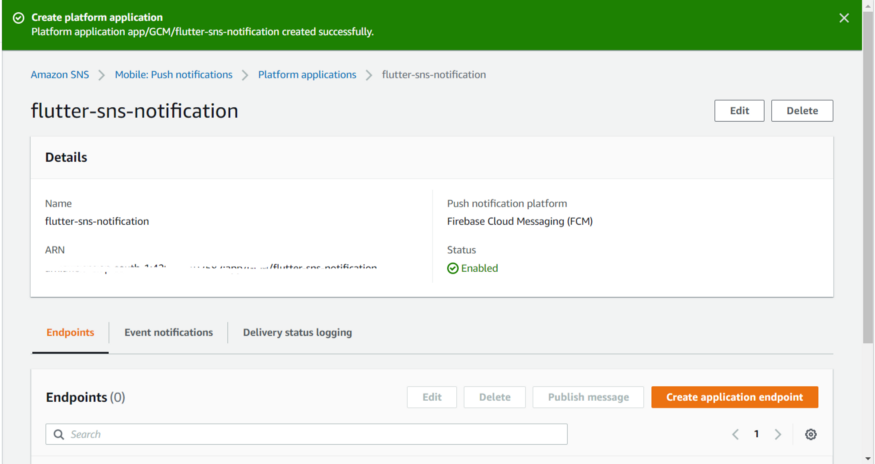

Now after the platform is created you will be redirected to the add endpoint dashboard. Here we will add the endpoints to which will be sending the notification. Endpoints are basically the devices here.

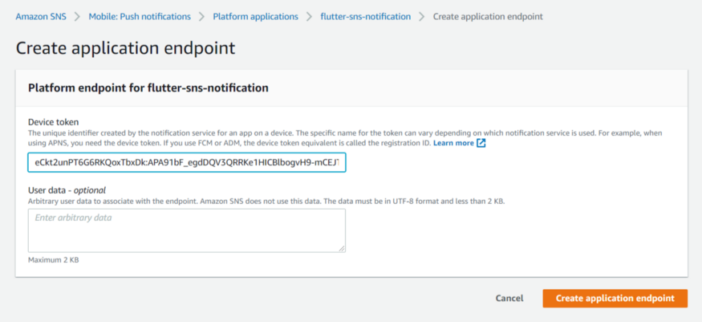

In the Create Application Endpoint, we have to add the device token which we copied from the VS Code terminal. After adding the token, click on the Create Application Endpoint and your device will be added as an endpoint.

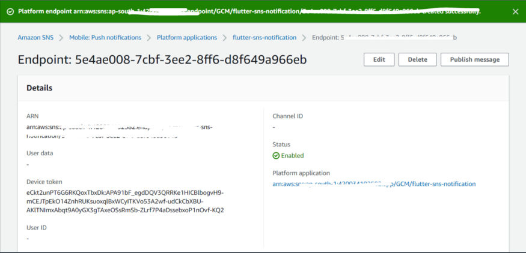

Now click on the publish message button and you will be redirected to a dashboard to publish your message.

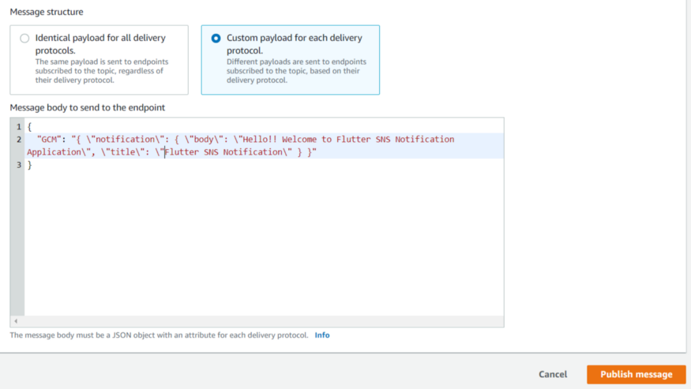

In the publish message dashboard, Click on the option "Publish Message" which will send you a notification on the device you used for the project. Here, we are defining our own custom payload for the notification message. A notification message with a Body and a Title will be sent to your Device.

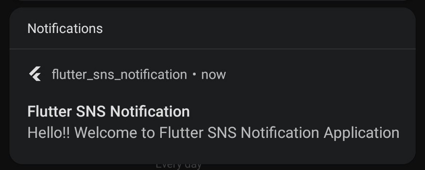

Hurray!!! We have successfully implemented the notification System in SNS and Flutter application. There are many other ways in which the notification system can be implemented in SNS such as the DynamoDB Streams, Lambda Functions. I hope this article has been useful to you.

I dedicate this article to the entire family of Camp+ for constantly supporting me and inspiring me to do great things in life. Thank you each and everyone for your support and guidance.

Thankyou for reading this article. I hope you find it useful and please share it with your friends and family.
