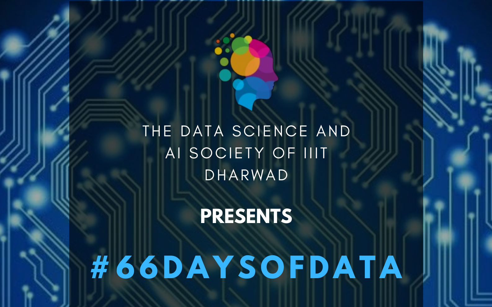

## What is #66daysofdata?

#66DaysOfData was started by a famous youtuber named Ken Jee. For 66 days, everyday you have to learn something related to Data Science for a minimum of 5 minutes (5 minutes since one cannot be free for a long time everyday) and then share it on social media. This idea was taken up by the Data Science and Artifical Intelligence (DSAI) Society of IIIT Dharwad to start this initiative for the students of IIIT Dharwad. The society intends to make the students aware of the importance of data science and ML, and to help them in their journey of learning.

For more information you can checkout the video [here](https://www.youtube.com/watch?v=qV_AlRwhI3I).

In this article, I will be documenting my day to day journey of #66daysofdata starting 19th February, 2022.

### Day 1 - 19th February, 2022

- Revised the various EDA techniques used for Data Visualization.
  - Ref: [Medium EDA](https://towardsdatascience.com/exploratory-data-analysis-eda-techniques-for-kaggle-competition-beginners-be4237c3c3a9)

### Day 2 - 20th February, 2022

- Today i learnt about the Singular Value Decomposition Technique (SVD) and how it can be used to reduce the dimensionality of the data.
  - Ref: [SVD](https://andrew.gibiansky.com/blog/mathematics/cool-linear-algebra-singular-value-decomposition/)
  - Ref: [Linear Algebra in SVD](https://medium.com/sho-jp/linear-algebra-101-part-9-singular-value-decomposition-svd-a6c53ed2319e)

### Day 3 - 21st February, 2022

- Hands on EDA coding on the Zomato Dataset. The dataset can be found here: [Zomato](https://www.kaggle.com/shrutimehta/zomato-restaurants-data)

  - Ref: [Krish Naik EDA on Zomato Dataset] (https://krishnaik.in/2022/02/17/day-1-live-eda-and-feature-engineering/)

### Day 4 - 22nd February, 2022

- Read an article on the "Curse of Dimensionality Reduction" and why it is important to have lesser optimal features instead of huge number of dimensions. The various methods to solve this problem in case of huge number dimensions are:

  - by the use of Cosine Similarity instead of the usual Euclidean Distance
  - Prinicipal Component Analysis (PCA)
  - Dimensionality Reduction using Kernel PCA
  - Dimensionality Reduction using Random Projection
  - Dimensionality Reduction using LDA

  - Ref: [Curse of Dimensionality Reduction](https://towardsdatascience.com/curse-of-dimensionality-a-curse-to-machine-learning-c122ee33bfeb)

### Day 5 - 23rd February, 2022

- Learnt about the various feature selection methods used in ML.
  - Correlation Matrix
  - Univariate Selection
  - ExtraTreesClassifier Method
  - Ref: [Feature Selection](https://www.analyticsvidhya.com/blog/2021/03/step-by-step-process-of-feature-engineering-for-machine-learning-algorithms-in-data-science/)

### Day 6 - 24th February, 2022

- Learnt about how to handle imbalanced data
  - Under-sampling majority class
  - Over Sampling Minority class by duplication
  - Over Sampling minority class using Synthetic Minority Oversampling Technique (SMOTE)

### Day 7 - 25th February, 2022

- Learnt about the various Feature learning techniques and did hands on coding with the Breast Cancer data.

### Day 8 - 26th February, 2022

- Revised statistics for Machine Learning

### Day 9 - 27th February, 2022

- Revised the math behind the regression techniques.
  - Ref: [Math behind Linear Reg](https://medium.com/mlearning-ai/the-mathematics-behind-linear-regression-fb4db1ebd7b5)
  - Ref: [Math behind Machine Learning](https://towardsdatascience.com/the-math-behind-machine-learning-b6f5c94fd1c0)

### Day 10 - 28th February, 2022

- Revised Neural Networks from scratch.
  - More emphasis on various Loss Functions and Optimizers.
  - The math behind these really excites me and I remember them as a story.

### Day 11 - 1st March, 2022

- Started revising Linear Algebra from basics. Would be doing this for a couple of days more.
  - Ref: [LA101 Part 1](https://medium.com/sho-jp/towards-understanding-linear-algebra-part-1-d43710535503)
  - Ref: [LA101 Part 2](https://medium.com/sho-jp/towards-understanding-linear-algebra-part-2-e51c948ad00)
  - Ref: [LA101 Part 3](https://medium.com/sho-jp/towards-understanding-linear-algebra-part-3-5bda805bd67e)

### Day 12 - 2nd March, 2022

- Still revising Linear Algebra.
  - Ref: [LA101 Part 4](https://medium.com/sho-jp/linear-algebra-101-part-4-6864630842b)
  - Ref: [LA101 Part 5](https://medium.com/sho-jp/linear-algebra-101-part-5-determinants-b54f990782cc)
  - Ref: [LA101 Part 6](https://medium.com/sho-jp/linear-algebra-101-part-5-determinants-b54f990782cc)

### Day 13 - 3rd March, 2022

- Still revising basic Linear Algebra. However today shifting towards the advanced topics like SVD and PCA. Studied the SVD's and PCA thoroughly and `I LOVE THE MATH`.
  - Ref: [LA101 Part 7](https://medium.com/sho-jp/linear-algebra-101-part-7-eigendecomposition-when-symmetric-4cd41d38269e)
  - Ref: [LA101 Part 8](https://medium.com/sho-jp/linear-algebra-101-part-8-positive-definite-matrix-4b0b5acb7e9a)
  - Ref: [LA101 Part 9 - SVD](https://medium.com/sho-jp/linear-algebra-101-part-9-singular-value-decomposition-svd-a6c53ed2319e)

### Day 14 - 4th March, 2022

- Studied more about roc Curves and used Keras Tuner for Classification problem.
- Ref: [AUC ROC Curves](https://www.analyticsvidhya.com/blog/2020/06/auc-roc-curve-machine-learning/)
- THE BEST docs for Keras Tuner are the Kears Docs itself. Hats off to the writers. Check them [here](https://keras.io/keras_tuner/)

### Day 15 - 5th March, 2022

- Learnt about the various Ensemble techniques in Machine Learning. Mainly the bagging, boosting and Voting. Would do the hands on coding later, now I am just trying to know things and understand the intuition.
  - Ref: [Ensemble Learning Techniques](https://www.analyticsvidhya.com/blog/2018/06/comprehensive-guide-for-ensemble-models/)

### Day 16 - 6th March, 2022

- Applied the Voting Ensemble classifier and also learnt about Startified KFold Cross validation.
  - For the Voting Classifier I prefer reading the sklearn docs, They provide a good oveview about the various params and also their examples are self sufficient/explainable.
  - Happy with the results i got using the Voting Classifier for a project of mine which uses real data. Would be speaking about that project once its complete. Using Voting Classifier we got `93%` accuracy while individually the models used to give accuracy not more than `90%`. In the Voting Classifier the models that I used are Logistic Regression, SVM and Decision Tree
  - Ref: [Sklearn Voting Classifier](https://scikit-learn.org/stable/modules/generated/sklearn.ensemble.VotingClassifier.html)
  - Ref: [Stratified KFold Cross Validation](https://towardsdatascience.com/stratified-k-fold-what-it-is-how-to-use-it-cf3d107d3ea2)

### Day 17 - 7th March, 2022

- Doing a quick recap of everything I learnt from Day 1 to Day 15.
  - Its important to revise your stuff regularly in the field of Data Science. I was supposed to revise it on Day 16 but eventually had to learn few things for my project.
  - No new learning today, but got a much better perspective about the previous topics after revising them.

Do checkout the article everyday if you wanna be a part of my journey for 66 days.

## Socials

- DSAI Society IIIT Dharwad Instagram - [@dsaisoc_iiitdwd](https://instagram.com/dsaisoc_iiitdwd?utm_medium=copy_link)
- #66daysofdata Discord - [#66daysofdata](https://discord.gg/)
