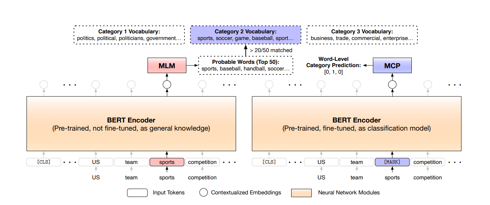

In this article we will be discussing the research paper on text classficiation using label names. The research paper is titled: `Text Classification Using Label Names Only: A Language Model Self-Training Approach` and it is published in the Conference on Empirical Methods in Natural Language Processing 2020. The research paper is available [here](http://chaozhang.org/papers/2020-emnlp-name.pdf)

So far, text classification has seen a huge succes in the NLP domain with the help of huge chunks of labelled data that is fed on to the models for training purposes. Recently, Semi Supervised learning has boomed using abundant unlabelled data and a smaller amount of labelled data. But when the number of classes are huge, it becomes a tedious task for the domain experts.

In this paper, the authors propose a approach in text classfication where a pretrained language model would be used to identify the category from unlabeled data and then train itself using the self training approach.

<!-- ## Related Work
### Neural Language Models
Models Like BERT, XLNet, RoBERTa, GPT-2, etc. have been used for text classification. These models are trained on large amounts of data, thus they understand the liguistic features and can serve as huge knowledge bases. 
Due to transformer architecture, these models are able to capture the contextual information of the text.

### Semi Supervised Learning and Zero Shot Learning
For semi-supervised text classification, one way is using augmentation based methods generate new instances via back translation, perturbations or interpolation and then they regularize those instances. Another way is using graph based methods. 

### Weakly Supervised Text Classification
Categorzing documents based on word-level descriptions of each category.  -->

### LOTClass
The authors propose a new method called LOTClass which stands for Label Only Text Classification. The method is built on three main components:
- Creating a category vocabulary for each class
- Model collects category indicative words from unlabeled data to train itself for having a contextualized understanding of the category.
- Generalizing the model on the entire unlabeled data using self training.

The below three sections will give a brief overview of how the authors deal with each of these components and it wonderful to see such a novel work in this field.

### Category Understanding via Label Name Replacement
Humans have the tendency to understand the semantics of a label name with the help of other keywords in its associated category.
In the paper the author uses BERT to see what words can replace the label name under most context. Accordingly, the top-50 words show most context with the label name. However, the author uses the top-100 words to create the category vocabulary of each class.

### Masked Category Prediction (MCP)

The above figure gives an overview of how the MCP works, firstly a Masked Language Model (MLM) checks for the probable words that can replace the token i.e. sports in the figure. Next, to decide if the token is category indicative, we compare the probable replacement words with the category vocabulary (as created in the previous sction) of the class. If the replacement words highly overlap the category vocabulary, then the token is considered to be category indicative.

Later, for each category indicative word, the author masks the word with the [MASK] token and then train the model to predict that word's indicating category.

This method allows the model the infer category based on word's context instead of simply memorizing context-free category words. 

### Self Training
Once the model is trained using the MCP, the authors use the self training approach to train the model on the entire unlabeled data. 
This approach is considered for the following reasons:
- Model has not seen many unlabelled documents after the MCP task as no category words were detected for it.
- The classifier was not trained on the sequence, it was only trained on the category words. Thus, the model is not able to understand the context of the document.

Here self training follows an iterative approach so that the model refines itself from its curent prediction to compute the target label.

The results and discussion can be seen in the paper itself.

### References
- Meng, Yu, Yunyi Zhang, Jiaxin Huang, Chenyan Xiong, Heng Ji, Chao Zhang, and Jiawei Han. "Text classification using label names only: A language model self-training approach." arXiv preprint arXiv:2010.07245 (2020).