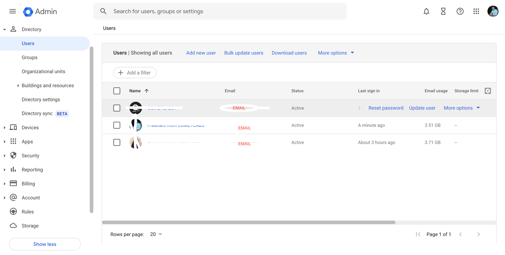
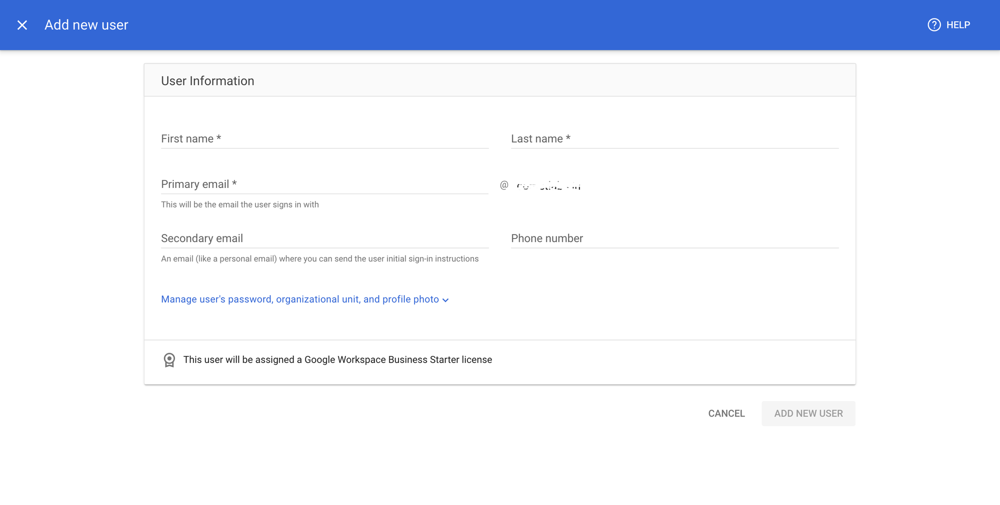
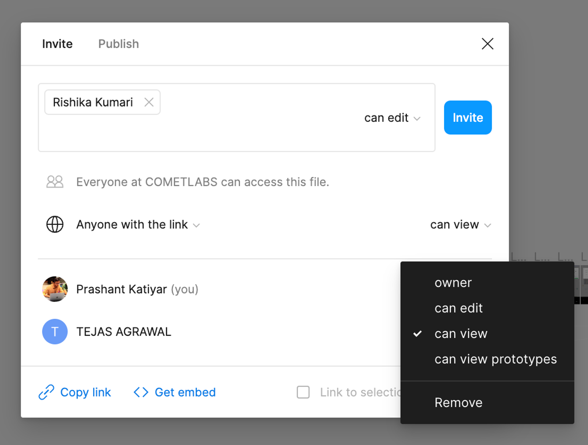
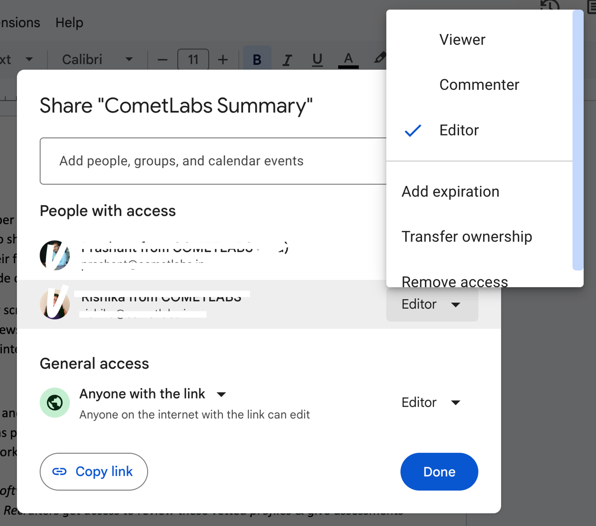
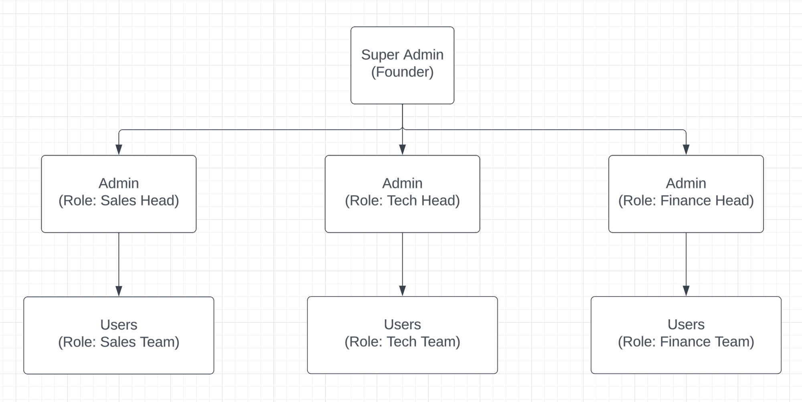

### Problem Statement

You have to write a PRD for an Admin, who should be able to manage user access for a simple SaaS application. For example, an Admin managing access to Gmail for a company.

**Key Points**

- Cover both functional and non-functional specs.
- It's a fairly standard and fairly small feature, so make sure you cover it end to end.
- List any assumptions that you make.
- Your goal is to ensure that developers do not have to make any assumptions whatsoever anywhere, even the smallest.
- You don't need to do UI. Assume the UI design has already been completed.

### About Zenskar

- Let us assume we’re building a User Access Management feature for a SaaS application called [Zenskar](https://www.zenskar.com/). 
- Zenskar replaces the in-house billing engineering team of a SaaS company with its product. It is a billing software that handles complex SaaS pricing and usage data. This platform is used by companies that have variable pricing for their SaaS product.
- When a company uses Zenskar, the role of their: 
    - *Sales Team* is to build and modify sales contracts.
    - *Backend Team* is to integrate product APIs to Zenskar sharing usage data.
    - *Finance Team* is to draft invoices based on sales contracts and usage data.

- The platform has a set of predefined user roles, as mentioned above.

### Introduction to the PRD

In this PRD, we outlined the requirements to build a User Access Management (UAM) feature in Zenskar, a SaaS application designed for managing complex billing and usage data for companies with variable SaaS product pricing. 

The UAM, sometimes called as the Identity and Access Management (IAM) feature, enables admins to control user access, permissions, and roles within the application.

### Purpose of UAM / IAM

- To provide administrative control over user access within Zenskar.
- To support the creation, modification, and deletion of user accounts.
- To enhance data security and regulatory compliance for Zenskar's customers.

### Example Snapshot of some known platforms

> A. Google Workspace Admin Dashboard
> 
> 
> 
Google Workspace Admin Dashboard, gives very simple User Access Management with Hierarchy : Admin > Normal User

> 
> 
> 
> 
And giving options to Add New Users and Manage Permissions.

> 

> B. File Sharing in Figma.
> 
> 
> 
> 
> 
Figma gives a better User Access Management feature in the form of file sharing. The admin can control and oversee other users’ access to the file, managing permissions and roles. 

> 
In Hierarchy : Owner > Can Edit > Can View > Can View Prototypes.

> 

> C. File Sharing in Google Docs.
> 
> 
> 
> 
> 
Similarly Google Docs, Sheets, etc. gives a file sharing feature. With 4 roles in Hierarchy: Owner > Editor > Commenter > Viewer. 

> 
Also, the ownership could also be transferred and roles could be temporary with an expiry.

> 

### Target Users

- Super Admin: Head of any organisation who buys a Zenskar subscription.
- Admin: Heads of Finance, Sales, or Tech teams, managing team collaboration and security.
- Users: General members of the Finance, Sales, or Tech teams.

### Functional Specifications

1️⃣ User Role Management
    <aside>

1. Users Hierarchy
    
    
    
Super-Admin > Admin > Normal Users

    
2. Super Admin Role
    - **Creation**: The account which purchased the subscription is Super Admin.
    - **Permissions**: Full user management and billing access.
3. Admin Role
    - **Creation**: Super-Admin can only assign Admin roles to users.
    - **Permissions**: Access to create, modify or delete a team in the respective domain.
4. Regular User Role
    - **Creation**: Created by respective Admins.
    - **Permissions**:  Access to assigned application features only.
    </aside>

2️⃣ User Account Management
    <aside>

1. Creating User Accounts
    - **Fields**: Name, Organisation’s Email, Secondary Email, Domain (Sales / Finance / Tech), Role (User / Admin / SuperAdmin)
    - **Validation**: Organisation’s Email: only company’s domain. Secondary Email: Only @icloud.com, @gmail.com, or @outlook.com to avoid fake temporary emails.
    - **Email Format**: Use Regex [^[a-zA-Z0-9._%+-]+@[a-zA-Z0-9.-]+\.[a-zA-Z]{2,}$].
2. Modifying User Accounts
    - **Allow edits**: Name, Role, Department.
    - **Restrictions**: Secondary Email is non-editable.
3. Deleting User Accounts
    - **Process**: Soft delete with a 30-day recovery period,
    - **Permissions**: Only Admins and Super Admin.
    </aside>

3️⃣ New User Invitation Process
    <aside>

1. Inviting New Users
    - **Functionality**: Admins and Super Admins can invite new users.
    - **Method**: Invitations will be sent via email containing a unique link.
    - **Expiry Period**: The invitation link will have an expiry period of 72 hours.
2. Account Creation for Invitees:
    - **Requirement**: Invitees must create a Zenskar account to accept an invitation.
    - **Process**: On clicking the invitation link, non-registered users will be redirected to the account creation page.
3. Dashboard Feature for Invitations
    - **Implementation**: A tab to be made in the dashboards of Super Admins and Admins to add and invite new users.
    - **Functionality**: It will allow them to manage invitations, track pending invitations, and view the history of sent invitations.
    </aside>

4️⃣ Access Rights and Permissions
    <aside>

1. Assigning Roles
    - **Process**: Default to 'user'; Super Admin elevates roles from a predefined list to promote them to admin or demote.
2. Assigning Domain/Department
    - **Process**: SuperAdmin can set at creation. Users will inherit their creator Domain.
3. Managing Permissions
    - **Super Admins:** Have all the permissions.
    - **Admins and Users:** Defined per domain:
        >
        | Role | Domain Access |
        | --- | --- |
        | Sales | Access to Contract Builder, Customer Data, CRM Integration |
        | Tech | Access to Usage Data, Integration APIs |
        | Finance | Access to Invoice Builder, Payments Board, Payment Reminders |
    - **User Interface**: Super Admins get a dedicated dashboard to create users, assign admin roles and see audit and compliance reports. Admins get a similar dashboard but are limited to respective team building and reports.
4. Revoking Access
    - **Immediate Effect**: Access is revoked in real-time and logged with timestamps.
    - **Revoking Hierarchy**: Super-Admin **>** Admin **>** Normal User.
    </aside>

5️⃣ Testing Strategy
    <aside>

1. **Unit Testing:** Ensure individual components meet functional requirements.
2. **Integration Testing:** Validate interactions between different parts of the UAM feature.
3. **User Acceptance Testing:** Conduct tests with target user groups to confirm usability and effectiveness.
    </aside>

6️⃣ Audit and Compliance
    <aside>

1. User Activity Logs
    - **Contents**: Login attempts, changes made, timestamps. (Logs should record who made the change, when, and what the change was).
    - **Access**: Respective Admins and Super Admin.
2. Monthly Compliance Reports detailing user list, role changes, and access revocations.
    </aside>

7️⃣ Use Cases
    <aside>

1. **Super Admin Onboarding**: A super admin sets up their organisation's structure in Zenskar, defining roles and permissions.
2. **Role Modification**: An admin modifies user roles to reflect changes in the team structure.
    </aside>

8️⃣ Technical Requirements
    <aside>

1. To define specific API endpoints for user management functions.
2. To outline data storage needs for user information and logs.
    </aside>

📌 Non-Functional Specifications
    <aside>

1. Security: 
    - **At Rest**: AES-256 encryption.
    - **In Transit**: TLS 1.3.
    - **Authentication Method**: OAuth 2.0, Multi-Factor Authentication (MFA)
2. Performance: 
    - Response times ≤ 2 seconds for user actions
    - ≤ 5 seconds for system actions, scalable up to 10,000 users.
3. Reliability: Target 99.9% uptime daily backups.
4. Compliance: 
    - GDPR Data Protection Regulation.
    - ISO 27001 Compliance Auditing Standard
    </aside>

## Conclusion

This PRD provides a comprehensive specification for the UAM feature in Zenskar, aiming to deliver clear, precise requirements to the development team and facilitate a development process without the need for assumptions.

# Full-text article
[Read article](https://kprashant.notion.site/kprashant/Humantic-AI-PRD-Prashant-Katiyar-6cd9f325db6441f5aa95fa6e21032fb5)